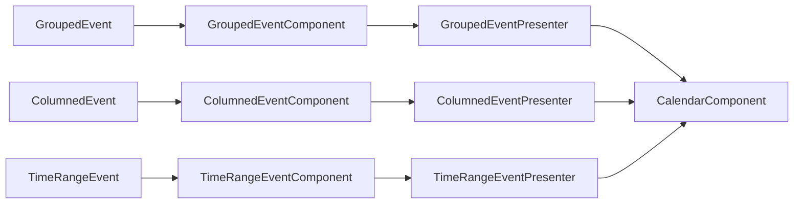

# Calendar Event Layout Manager

This project tackles the challenge of rendering events on a calendar without visual overlaps, ensuring that every overlapping event shares the same width and each event utilizes the maximum width available. Developed with a focus on Clean Architecture principles and TDD (Test-Driven Development), this solution leverages Vite, Vitest, and TypeScript to create a robust, maintainable, and scalable application.

You can find the live demo [here](https://codesandbox.io/p/github/Zelcider/planity-test/main?workspaceId=f445c1d1-794c-4f02-9262-c64b06db8cbf).

And the initial problem statement [here](

## Code Structure

The codebase is structured into several main parts:

- `entities`: This directory contains the domain entities used throughout the application.
- `use-cases`: This directory contains the use cases that define the business logic of the application, such as calculating event overlaps and determining event dimensions.
- `components`: This directory contains the React components used to build the user interface.
- `interface-adapters`: This directory contains the presenter components that connect the entities with the components.

Here is a flow graph that shows how these parts interact:



In this graph:

- `GroupedEvent`, `ColumnedEvent`, and `TimeRangeEvent` are the domain entities.
- `GroupedEventComponent`, `ColumnedEventComponent`, and `TimeRangeEventComponent` are the React components.
- `GroupedEventPresenter`, `ColumnedEventPresenter`, and `TimeRangeEventPresenter` are the presenter components that connect the entities with the components.
- `CalendarComponent` is the main component that uses the presenter components to render the calendar.

## Getting Started

These instructions will get you a copy of the project up and running on your local machine for development and testing purposes.

### Prerequisites

What things you need to install the software and how to install them.

- Node.js
- npm

### Installing

Run this command to install the dependencies:

```bash
npm install
```

## Running the tests

This project uses `vitest` for testing. To run the tests, use the following command:
```bash
npm test
```

## Running the application

To run the application, use the following command:
```bash
npm run dev
```

## Built With

- [React](https://reactjs.org/) - The web framework used
- [TypeScript](https://www.typescriptlang.org/) - Static typing for JavaScript
- [Vite](https://vitejs.dev/) - Build tool and development server

## Contributing

Please read [CONTRIBUTING.md](https://gist.github.com/PurpleBooth/b24679402957c63ec426) for details on our code of conduct, and the process for submitting pull requests to us.


## Authors

- **Romuald FERRANTE**  - [Zelcider](https://github.com/Zelcider)

See also the list of [contributors](https://github.com/your/project/contributors) who participated in this project.

## License

This project is licensed under the MIT License - see the [LICENSE.md](LICENSE.md) file for details

